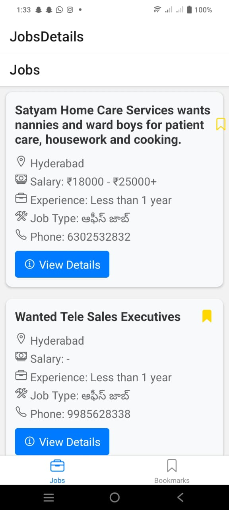
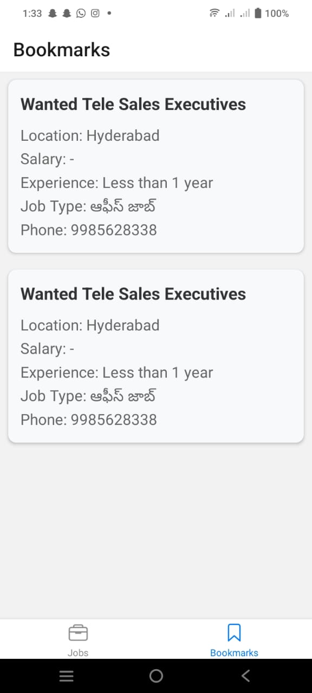
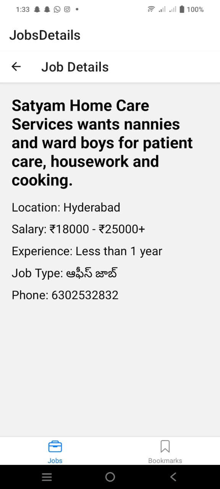

---

# Job Searching App

A React Native application for browsing job listings, bookmarking jobs, and viewing saved bookmarks.

## Features

- **Job Listings**: Browse through available job listings with details.
- **Bookmark Jobs**: Bookmark job listings to view later.
- **View Bookmarks**: Access and view all bookmarked jobs.
- **Offline Storage**: Bookmarks are saved locally for offline access.

## Project Structure

```
joblistingapp/
├── api/
│   └── api.js                # API functions for fetching jobs
├── screens/
│   ├── BookmarksScreen.js    # Screen displaying bookmarked jobs
│   ├── JobDetailScreen.js    # Screen displaying details of a single job
│   └── JobsScreen.js         # Main screen displaying job listings
├── components/
│   ├── BookmarkManager.js    # Functions for managing bookmarks (save, remove, get)
│   └── AppNavigator.js       # App navigation setup
├── App.js                    # Main entry point of the app
├── package.json              # Project metadata and dependencies
└── README.md                 # Project documentation
```
## React Native Installation
```java
npm install -g expo-cli
expo init JobApp or npx create-expo-app jobsearch --template blank
cd JobApp
```

## Mobile Application Screens

### Screen 1: Job Lists Screen

- **Description**: Displays a list of job postings with options to bookmark and view details.

  

### Screen 2: Bookmarked Jobs Screen

- **Description**: Displays a list of bookmarked jobs retrieved from local storage.

  

### Screen 3: Job Detail Screen

- **Description**: Shows detailed information about a specific job.

  

## Video Presentation

You can watch live application here: [Job Search Application](https://drive.google.com/file/d/1drBh6hSyXt3T7SH5232pMuOGaSqg8n_Y/view?usp=sharing)


## Components

### `api/api.js`

Handles API calls for fetching job listings. Replace with actual API endpoints as needed.

### `screens/JobsScreen.js`

Displays a list of job postings. Allows users to bookmark jobs and view job details.

### `screens/BookmarksScreen.js`

Displays a list of bookmarked jobs. Fetches bookmarked jobs from local storage and displays them.

### `screens/JobDetailScreen.js`

Shows detailed information about a specific job. Accessible from the `JobsScreen`.

### `components/BookmarkManager.js`

Provides functions to save, remove, and retrieve bookmarks using `AsyncStorage`.

### `components/AppNavigator.js`

Sets up navigation between screens using `@react-navigation/native` and `@react-navigation/native-stack`.

## Functional Requirements

- **Bottom Navigation**: Users are presented with a bottom navigation UI with “Jobs” and “Bookmarks” as sections.
- **Jobs Screen**: Fetches data from an API with infinite scroll. Displays job title, location, salary, and phone number.
- **Job Details**: Clicking on a job card navigates to a screen showing more details about the job.
- **Bookmark Jobs**: Users can bookmark jobs, and these will appear in the “Bookmarks” tab.
- **Offline Storage**: All bookmarked jobs are stored locally for offline viewing.
- **State Management**: Handles appropriate states for loading, errors, and empty states throughout the app.

## Troubleshooting

- **Module Not Found Errors**: Ensure all dependencies are installed and properly linked.
- **Bookmark Not Showing**: Verify that bookmarks are being saved and retrieved correctly. Ensure local storage is functioning.

---

